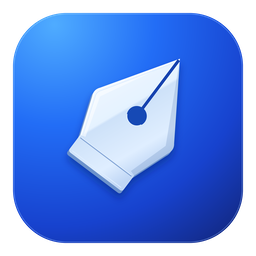

<p align="center">
  
</p>

<h1 align="center">NoSVG</h1>

<p align="center">
  A desktop, AI-first SVG asset editor for Windows, macOS and Linux.<br>
  Free to download and use.
</p>

<p align="center">
  <a href="https://github.com/bigclumsypanda/nosvg-app/releases"><strong>Download</strong></a>
  ·
  <a href="https://github.com/bigclumsypanda/nosvg-app/issues">Report a problem</a>
  ·
  <a href="#support-the-project">Support the project</a>
</p>

---

## What it is

NoSVG is not a conventional vector editor with AI bolted on. You work with
semantic layers, groups, adjustable parameters, references and a chat; the AI
edits your artwork through a structured toolset that touches only the parts of
the SVG it needs to.

- **Asset-first** — transparent assets by default, no background unless you ask for one.
- **Semantic layers and parameters** — the agent names what it draws and exposes
  colors, sizes and toggles you can fine-tune in the Inspector without asking again.
- **Every change is reversible** — AI edits, drawing and layer changes all go through Undo/Redo.
- **Packs and frames** — one portable `.nosvg` project file holds several independent
  workspaces with named frames, autosave and crash recovery.
- **Drawing mode** — sketch over a frame with pens, brushes, shapes and text.
- **Bring your own AI** — OpenAI, Anthropic, Google, a ChatGPT subscription, any
  OpenAI-compatible endpoint or a model running locally on your machine.
- **MCP mode** — expose the editor's tools to external MCP clients.
- **Export** — SVG, PNG and layered formats (Photoshop PSD, OpenRaster, Aseprite).
- **Safe by design** — imported SVG never runs scripts; credentials are kept in
  the system's secure storage.

## Download

Get the latest version from the [Releases page](https://github.com/bigclumsypanda/nosvg-app/releases).

| System                    | File                             |
| ------------------------- | -------------------------------- |
| Windows 10 / 11           | `NoSVG_<version>_x64-setup.exe`  |
| macOS (Apple Silicon)     | `NoSVG_<version>_aarch64.dmg`    |
| Linux — any distribution  | `NoSVG_<version>_amd64.AppImage` |
| Linux — Debian / Ubuntu   | `NoSVG_<version>_amd64.deb`      |
| Linux — Fedora / openSUSE | `NoSVG-<version>-1.x86_64.rpm`   |

## Installation

NoSVG is a free project, and its installers are not yet signed with paid
code-signing certificates. Your system will warn you the first time you open it;
this is expected.

### Windows

1. Run `NoSVG_<version>_x64-setup.exe`.
2. If Windows SmartScreen shows "Windows protected your PC", click
   **More info → Run anyway**.

The installer sets up Microsoft Edge WebView2 automatically if it is missing.

### macOS

1. Open the `.dmg` and drag **NoSVG** into **Applications**.
2. Open NoSVG. When macOS says it cannot verify the developer, open
   **System Settings → Privacy & Security** and click **Open Anyway** next to
   the NoSVG message, then confirm.

If macOS reports that the app "is damaged", remove the download quarantine flag
once in Terminal:

```bash
xattr -dr com.apple.quarantine /Applications/NoSVG.app
```

### Linux

AppImage (no installation needed):

```bash
chmod +x NoSVG_*_amd64.AppImage
./NoSVG_*_amd64.AppImage
```

Debian / Ubuntu:

```bash
sudo apt install ./NoSVG_*_amd64.deb
```

Fedora / openSUSE:

```bash
sudo dnf install ./NoSVG-*.x86_64.rpm
```

NoSVG needs WebKitGTK 4.1, available on Ubuntu 22.04, Debian 12, Fedora 36 and newer.

### Verifying a download

Every release includes a `SHA256SUMS` file. To check a file you downloaded:

```bash
sha256sum --check --ignore-missing SHA256SUMS   # Linux
shasum -a 256 NoSVG_<version>_aarch64.dmg       # macOS: compare with SHA256SUMS
```

On Windows (PowerShell), compare the output of
`Get-FileHash NoSVG_<version>_x64-setup.exe` with the matching line in `SHA256SUMS`.

## Getting started

1. Create a project on the start screen, or open an existing `.nosvg` file.
2. Open the **Providers** tab and add an AI provider: paste an API key, sign in
   with a subscription, or point NoSVG at a local OpenAI-compatible server.
3. Describe what you need in the chat — for example _"a flat red motorcycle,
   side view, as a game asset"_ — and adjust the result with the Inspector
   controls, the layer tree or drawing mode.

Your projects, chats and settings stay on your computer. Requests go only to the
AI provider you configure.

## Feedback

Found a bug or have an idea? [Open an issue](https://github.com/bigclumsypanda/nosvg-app/issues).
For bugs, the **Error log** in the **About** tab collects details that help a lot.

## Support the project

NoSVG is free and built by one developer. If it saves you time, you can support
its development:

- [Tipeee](https://en.tipeee.com/andriiplaksin/) — one-time or monthly tips
- [Ko-fi](https://ko-fi.com/skystm) — buy a coffee, no account needed
- [Patreon](https://www.patreon.com/cw/SkySTM) — monthly support and development updates

## License

NoSVG is free to use for personal and commercial work under the
[NoSVG Proprietary Freeware License](LICENSE.txt). Assets you create with NoSVG
belong to you. Licenses of the open-source components are listed in
`THIRD_PARTY_NOTICES.txt`, attached to every release and available in the app
under **About**.

Copyright © 2026 Andrii Plaksin.
